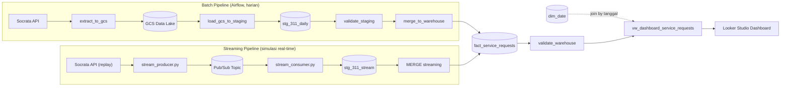

# FinPro Elvita — NYC 311 Service Request Pipeline

Final Project JCDEAH-009 — end-to-end data pipeline untuk dataset **NYC 311 Service Requests**, dari ekstraksi data mentah sampai dashboard monitoring.

## Problem Statement & Business Goal

NYC 311 Service Request Monitoring — membantu pihak kota memahami jenis komplain warga yang paling sering muncul, dan mengukur kecepatan tiap agency dalam menyelesaikan komplain, sebagai dasar evaluasi kinerja dan alokasi sumber daya.

## Dashboard

🔗 [Looker Studio Dashboard](https://datastudio.google.com/s/iu5AbxR0lhE)

## Arsitektur

Batch dan streaming masing-masing punya staging (raw layer) sendiri, tetapi **keduanya bermuara ke satu fact table yang sama** (`fact_service_requests`) lewat proses `MERGE`, dibedakan lewat kolom `ingestion_source`.



Orkestrasi batch: **Apache Airflow** (LocalExecutor, Docker Compose), DAG: `finpro_elvita_nyc311_daily_batch`, jadwal: harian.

*Catatan streaming: NYC 311 tidak menyediakan feed real-time asli. Komponen ini mensimulasikan aliran data dengan me-replay data terbaru satu per satu (jeda ~1 detik) lewat Pub/Sub. Tiap pesan mendarat dulu di `stg_311_stream` (raw), baru di-`MERGE` ke `fact_service_requests` di akhir sesi.*

### Alerting

Setiap task Airflow yang gagal otomatis memicu `on_failure_callback` (`alert_on_pipeline_failure`) yang mencatat detail kegagalan (DAG, task, waktu, exception, link log) ke `logs/pipeline_alerts.log`.

## Data Modeling

Pendekatan: **star schema** sederhana, dengan staging (raw/bronze layer) terpisah dari layer warehouse yang sudah di-model.

**Fact table — `fact_service_requests`**
- Grain: satu baris = satu laporan (service request) NYC 311, diidentifikasi lewat `unique_key`.
- Diisi dari dua pipeline (batch & streaming) yang sama-sama melakukan `MERGE` (upsert) ke tabel ini — dibedakan lewat kolom `ingestion_source` (`batch` / `streaming`), sehingga bisa dilacak asal baris terakhir di-update dari mana.
- Terhubung ke `dim_date` lewat kolom tanggal `source_partition_date` — tidak pakai surrogate key terpisah, karena nilai tanggal itu sendiri sudah jadi kunci alami yang unik.

**Dimension table — `dim_date`**
- Natural key: `dt_y_m_d` (DATE).
- Struktur atribut diadaptasi dari [jonsunderland/dim_date](https://github.com/jonsunderland/dim_date), diporting ke BigQuery native SQL.
- Berisi atribut turunan tanggal (nama bulan, hari dalam minggu, nomor minggu ISO, awal/akhir bulan, dst.) untuk mempermudah agregasi di dashboard — misalnya membandingkan volume komplain hari kerja vs akhir pekan, atau tren per bulan/minggu, tanpa perlu hitung manual di level query.

**Staging layer (raw)**
| Tabel | Sumber | Diisi oleh |
|---|---|---|
| `stg_311_daily` | GCS Data Lake (harian) | `load_gcs_to_staging` (Airflow) |
| `stg_311_stream` | Pub/Sub (real-time, per pesan) | `stream_consumer.py` |

Keduanya jadi sumber untuk proses `MERGE` terpisah ke `fact_service_requests`, dengan logic type-casting dan dedup yang identik (`QUALIFY ROW_NUMBER() ... = 1` per `unique_key`, ambil versi terbaru berdasarkan `etl_extracted_at`).

**Semantic layer**
- `vw_dashboard_service_requests` — VIEW transformasi final (menghitung `resolution_hours` dari `created_at`/`closed_at`) yang langsung dikonsumsi Looker Studio.

## Data Quality

- **validate_staging** — jumlah baris staging harus sesuai hasil ekstraksi, tidak ada `unique_key` NULL, tidak ada duplikat.
- **validate_warehouse** — jumlah baris warehouse per partisi tanggal sesuai staging, tidak ada duplikat `unique_key`, kolom kunci (`unique_key`, `created_at`) tidak NULL.
- **ingestion_source** — melacak apakah baris terakhir di-*upsert* oleh pipeline `batch` atau `streaming`.

## Tech Stack

| Komponen | Teknologi |
|---|---|
| Orkestrasi | Apache Airflow (Docker Compose, LocalExecutor) |
| Data Lake | Google Cloud Storage |
| Data Warehouse | BigQuery |
| Streaming | Google Cloud Pub/Sub |
| Dashboard | Looker Studio |
| Bahasa | Python 3.12, SQL (BigQuery Standard SQL) |

## Struktur Folder

```
dags/     DAG Airflow (finpro_elvita_nyc311_daily_batch.py)
sql/      create_warehouse, alter_warehouse_add_ingestion_source,
          create_dim_date, create_stream_staging,
          merge_service_requests, merge_stream_to_warehouse,
          create_dashboard_view
src/      Script ekstraksi (extract_nyc311.py) dan streaming
          (stream_producer.py, stream_consumer.py)
docs/     Dokumentasi tambahan
```

## Cara Menjalankan

1. `docker compose up -d`
2. Buka Airflow UI di `http://localhost:8080`
3. DAG `finpro_elvita_nyc311_daily_batch` berjalan otomatis sesuai jadwal harian, atau bisa di-trigger manual
4. Untuk demo streaming, di folder `src/`, jalankan di dua terminal terpisah:
   - `python stream_consumer.py`
   - `python stream_producer.py`

Cek hasil gabungan batch + streaming:

```sql
SELECT ingestion_source, COUNT(*) AS total_rows
FROM `jcdeah-009.finpro_elvita_nyc311_dw.fact_service_requests`
GROUP BY ingestion_source
```